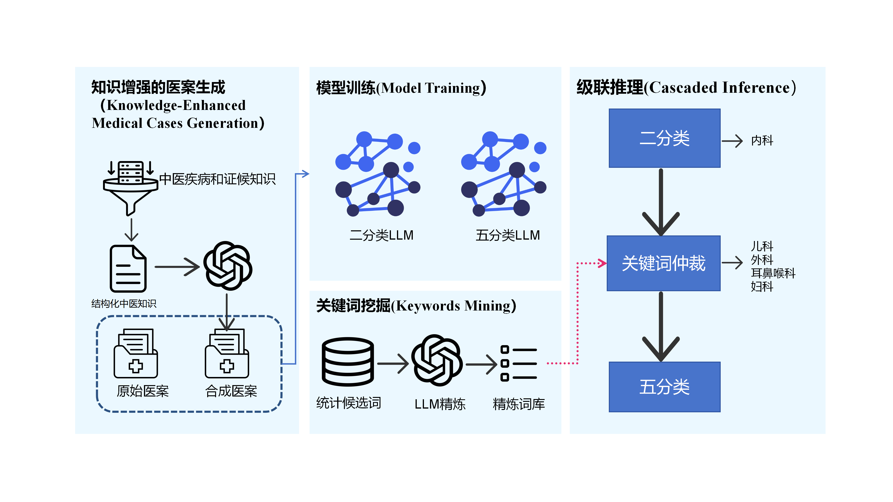
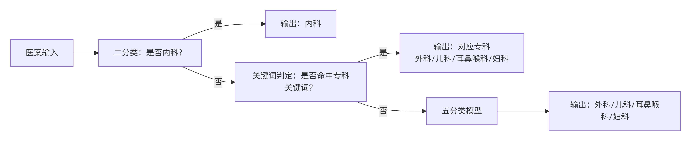

# TCM Clinical Cases Classification

中医医案分类系统——基于大语言模型的中医病例智能分科系统，支持二分类（内科/非内科）和五分类（内科|外科|妇科|耳鼻喉科|儿科）两种推理模式。

## 项目概述

本项目针对中医医案自动分科这一临床需求，构建了一套完整的分类 pipeline，包括：

- **两阶段分类pipeline**：先二分类（判断是否为内科），再五分类（细粒度分科）
- **领域关键词挖掘**：基于统计学方法 + LLM 专家知识提取各科室特征词
- **合成数据生成**：利用 LLM 生成高质量训练数据
- **混合推理集成**：将 LLM 推理结果与专家规则融合，提升分类准确性

## 技术路线



## 分类判定流程



## 项目结构

```
.
├── data/                          # 数据目录
│   ├── train/                      # 训练数据
│   │   ├── train_stage1_binary_9616.json         # 阶段一：二分类训练集
│   │   ├── train_stage2_5_category_4903.json    # 阶段二：五分类训练集
│   │   └── train_original_5_category_4903.json   # 原始五分类数据集
│   ├── test/
│   │   └── tcm_test.json                       # 测试集
│   └── synthetic_data/                       # 合成数据
│       ├── generate_pediatric_cases.py       # 儿科合成数据生成脚本
│       ├── Synthetic_Data_Binary_Classification.json
│       ├── Synthetic_Data_5_Category_Classification.json
│       └── 中医疾病知识条目.txt
├── inference/                       # 推理脚本
│   ├── inference_binary_classification.py      # 二分类推理
│   ├── inference_5_category_classification.py  # 五分类推理
│   └── inference_hybrid_ensemble.py            # 混合集成推理
├── keywords_mining/                 # 关键词挖掘
│   ├── keywords_mining.py            # 基于统计的关键词挖掘
│   ├── LLM_extract_keywords.py       # LLM 专家知识关键词提取
│   └── final_expert_keywords.json    # 最终专家关键词库
├── eval/                             # 评估脚本
│   └── merge_results.py              # 混合推理结果评估与报告生成
├── figs/                             # 项目图表
│   ├── 技术路线_01.png
│   └── 判定流程图.png
└── results/                          # 推理结果输出目录
```

## 分类类别

| 编号 | 科室 | 说明 |
|------|------|------|
| 0 | 内科 | 涉及脏腑、气血、阴阳等整体性病理分析 |
| 1 | 外科 | 涉及疮疡、损伤、外感等外部病症 |
| 2 | 妇科 | 涉及经、带、胎、产等妇科特有病症 |
| 3 | 耳鼻喉科 | 涉及五官（眼耳鼻喉口）局部病症 |
| 4 | 儿科 | 涉及小儿特有病症与诊治特点 |

## 环境配置

```bash
# 依赖主要 Python 包
pip install torch transformers openai loguru tqdm scikit-learn pandas jieba
```

## 使用方法

### 1. 关键词挖掘（可选）

```bash
python keywords_mining/keywords_mining.py
python keywords_mining/LLM_extract_keywords.py
```

### 2. 推理

```bash
# 二分类推理
python inference/inference_binary_classification.py --gpu 0

# 五分类推理
python inference/inference_5_category_classification.py --gpu 0

# 混合集成推理
python inference/inference_hybrid_ensemble.py
```

### 3. 评估

```bash
python eval/merge_results.py
```

## 环境变量

使用 LLM 相关功能需要配置以下环境变量：

```bash
export OPENAI_API_KEY="your-api-key"
```

## 模型基础

本项目基于 [GLM-4-9B-Chat](https://github.com/THUDM/GLM-4) 微调模型进行推理，具体模型路径在推理脚本中配置。
